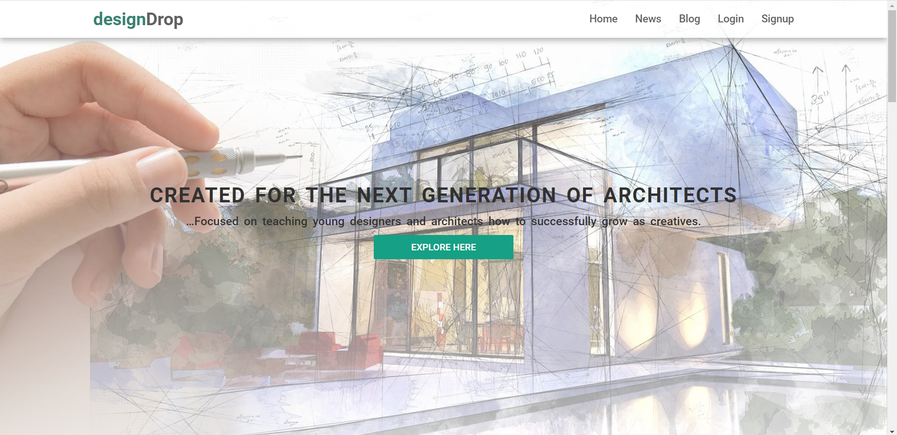
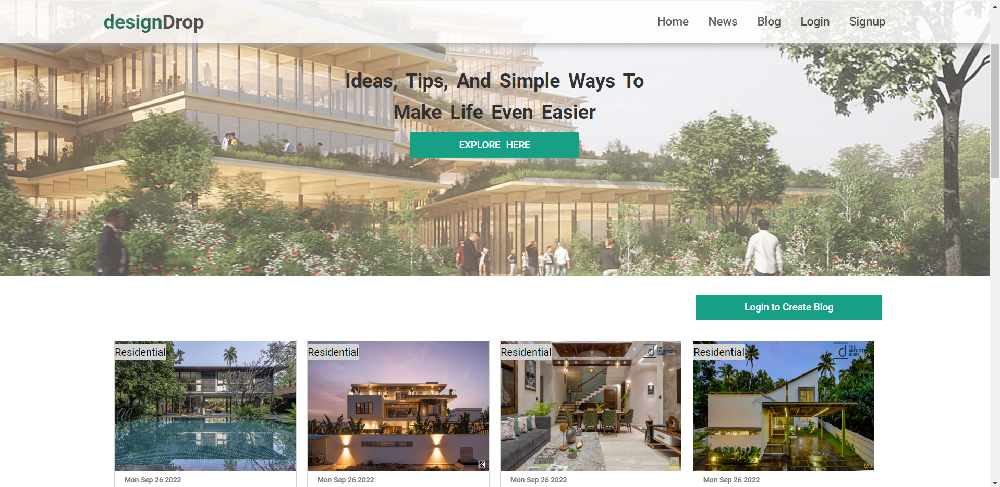
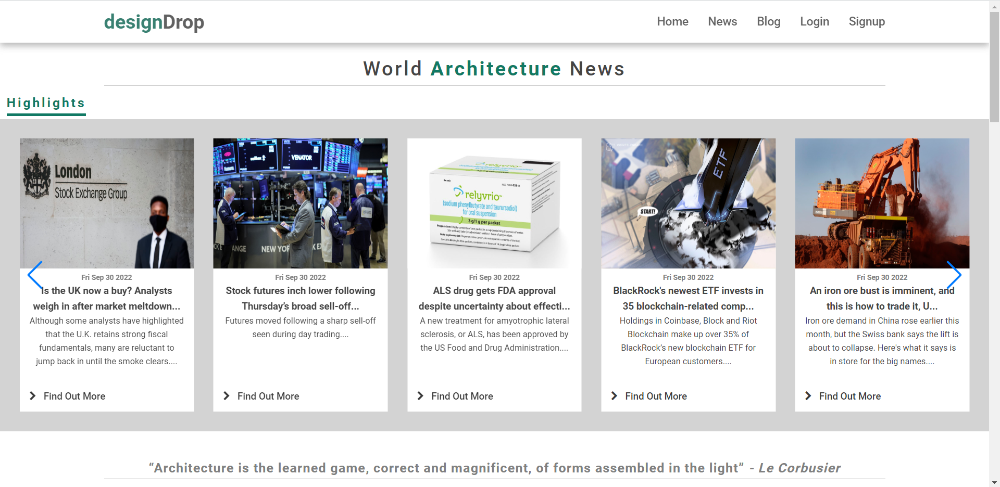
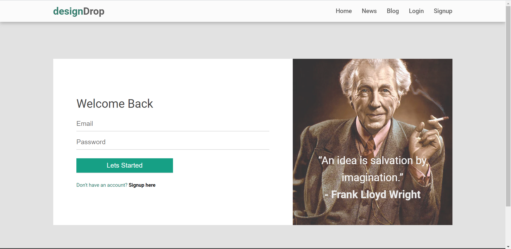
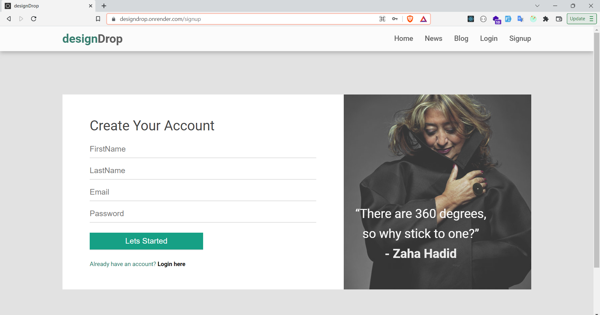

# DesignDrop

## Table of contents

- [Introduction](#introduction)
- [Demo](#demo)
- [Features](#features)
- [Technology](#technology)
- [Database Models](#database)
- [Run](#run)
- [License](#license)
- [Backend](#backend)

## Introduction

A virtual blog,Articles,and news application using the MERN stack (MongoDB, Express js, React js, and Node js).

## Demo

This application is deployed on render and can be accessed through the following link:

[MERN designDrop on render](https://designdrop.onrender.com/)

## Technology

The main technologies used to build this application are:

- Node.js 
- MongoDB 
- Express.js 
- React.js 

## Features

A blog app with the following features.

Unlogged in users can do the following:

- View all posts.
- View all news.
- View all articles.
- View one post's content by clicking on it.
- View post's comments.
- Signup.

In addition to the above points, logged in users can do the following:

- Login or logout.
- View all news.
- Create a new post.
- View/Edit/delete their posts.
- Add a new comment on a post.
- View/Edit/Delete their comments.

## Database

All the models can be found in the models directory created using mongoose.

### User Schema:

- userName (String)
- email (String)
- password (String)
- imagePath (String)

### Post Schema:

- title (String)
- content (String)
- imagePath (String)
- createdAt (Date)
- createdBy (ObjectID - a reference to the user's table)
- comments (ObjectID - an array of comments on the post)

### Comment Schema:

- content (String)
- createdAt (Date)
- createdBy (ObjectID - a reference to the user's table)

## Run

To run this application (the master branch), you have to set your own environmental variables in the server root folder. For security reasons, some variables have been hidden from view and used as environmental variables with the help of dotenv package. Below are the variables that you need to set in order to run the application:

- MONGO_URI: this is the connection string of your MongoDB database.

- SECRET_KEY: you can provide any string here, it is used to encrypt the JWT authentication token.

## License

- MIT License
- Copyright 2022 © [Shripad Thorat](https://github.com/shripad5258/designdrop)

## Backend
- [designDrop Backend](https://github.com/shripad5258/designdropapi)
